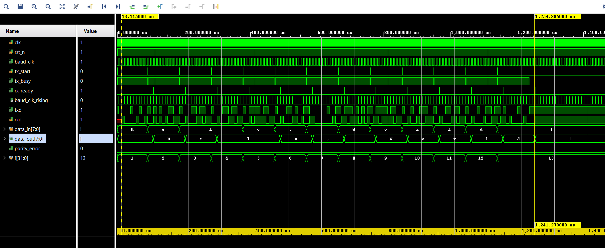

# UART Interface
Complete hardware implementation of UART Tx and Rx serial communication using verilog

# Sample UART transmission 
Below waveform shows UART transmision of the message "Hello, World!" using a loopback connection (self test by connecting Tx directly to Rx)! 

For demo, I used 200MHz system clock and a baud rate of 115200! The module is highly flexible and configurable for other baud rates and system clocks as needed!

